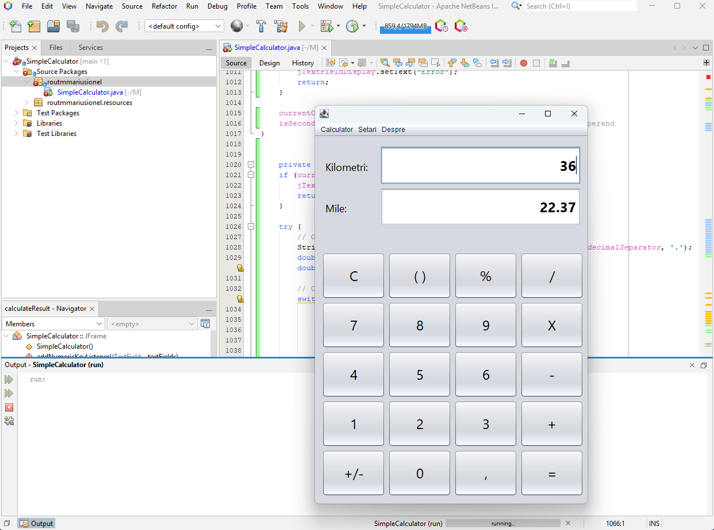
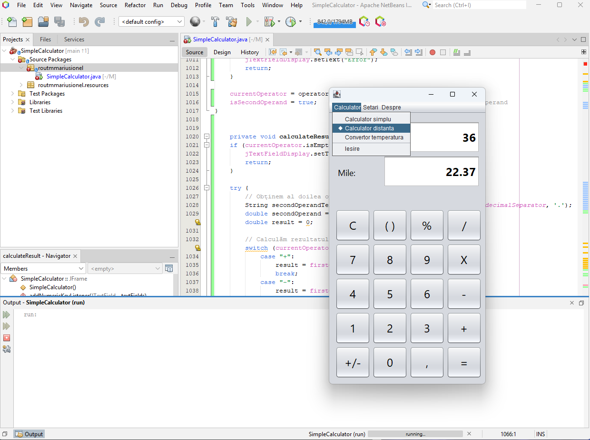
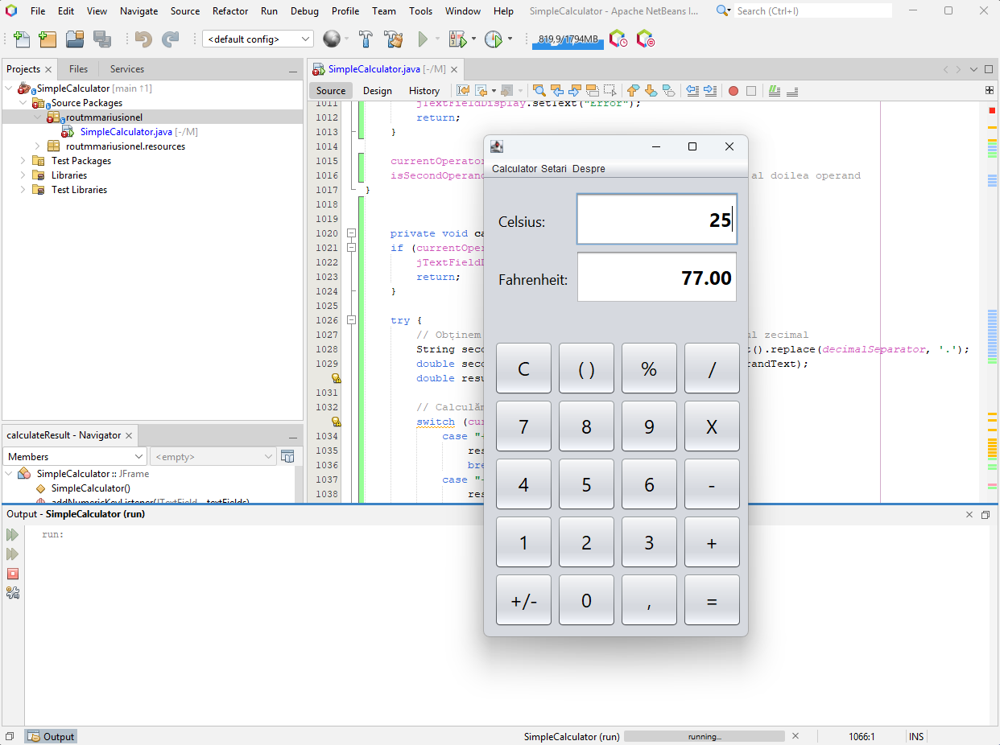

# Simple Calculator Project

> WARNING: This is a poject for Proiectarea Interfetelor Utilizator Homework

> DO NOT USE IT IN PRODUCTION

> ALL RIGHTS RESERVED

> Vezi repo parinte: [Proiectarea Interfetelor Utilizator](https://github.com/lightvision/Proiectarea_Interfetelor_Utilizator)

---

Acest proiect este implementat in Apache Netbeans IDE folosind Java Swing.

Este un calculator simplu care are 3 componente:
- Calculator simplu
- Convertor de distanta
- Convertor de temperatura.

## Structura meniului aplicatiei
- Calculator
    - Calculator simplu (implicit)
    - Convertor distanta
    - Convertor temperatura
- Setari
    - Limba
- Despre
    - Despre calculator

## Particularitati
- Schimbarea intre cele 3 calculatoare se face din meniul Calculator.
- Mesajele afisate nu sunt hard-codate, si se foloseste un pachet de limba
    - Sunt implementate 2 pachete de limba: romana si engleza.
    - In interfata, proprietatea text este configurata la valoarea cheii pentru respectiva componenta din interfata
- Aplicatia foloseste o icoana particularizata
- Layout-ul este complex iar butoanele sunt desenate 1 singura data dupa care sunt mutate pe fiecare calculator;
- Butoanele mutate sunt dezactivate/reactivate in functie de contextul calculatorului.

## Screenshots:
- Redimensionarea fluida a interfetei grafice: 
- Calcularea distantei: 
- Conversia temperaturii: 
